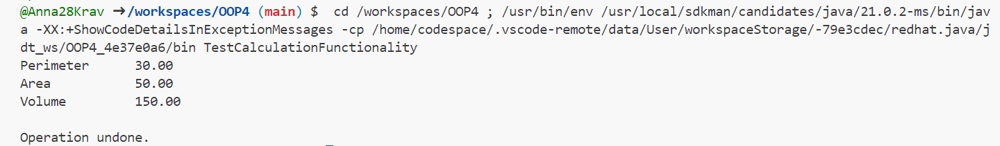

# OOP4

# **Завдння 5**

**5.1) Реалізувати можливість скасування (undo) операцій (команд):**

**Код CalculationData:**
````java
import java.io.Serializable;

// Клас, що представляє дані для обчислень
public class CalculationData implements Serializable {
    private static final long serialVersionUID = 1L;
    private double length;
    private double width;
    private double height;

    // Конструктор класу
    public CalculationData(double length, double width, double height) {
        this.length = length;
        this.width = width;
        this.height = height;
    }

    // Методи для обчислення периметру, площі та об'єму
    public double calculatePerimeter() {
        return 2 * (length + width);
    }

    public double calculateArea() {
        return length * width;
    }

    public double calculateVolume() {
        return length * width * height;
    }

    // Геттери для отримання параметрів
    public double getLength() {
        return length;
    }

    public double getWidth() {
        return width;
    }

    public double getHeight() {
        return height;
    }
}
````

**Код CreateCalculationDataCommand:**
````java
// Команда для створення CalculationData
public class CreateCalculationDataCommand implements Command {
    private CalculationDataFactory factory;
    private double length;
    private double width;
    private double height;
    private CalculationData data;

    public CreateCalculationDataCommand(CalculationDataFactory factory, double length, double width, double height) {
        this.factory = factory;
        this.length = length;
        this.width = width;
        this.height = height;
    }

    @Override
    public void execute() {
        data = factory.createCalculationData(length, width, height);
    }

    @Override
    public void undo() {
        // Відміна створення об'єкта
        data = null;
    }

    public CalculationData getData() {
        return data;
    }
}
````

**Код Command:**
````java
// Інтерфейс для команд
interface Command {
    void execute();
    void undo();
}
````


**5.2) Продемонструвати поняття "макрокоманда":**

**Код MacroCommand:**
````java
import java.util.Stack;

// Макрокоманда для виконання групи команд
public class MacroCommand implements Command {
    private Stack<Command> commands = new Stack<>();

    // Метод для виконання всіх команд в макрокоманді
    @Override
    public void execute() {
        for (Command command : commands) {
            command.execute();
        }
    }

    // Метод для скасування всіх команд в макрокоманді
    @Override
    public void undo() {
        for (Command command : commands) {
            command.undo();
        }
    }

    // Метод для додавання команди до макрокоманди
    public void addCommand(Command command) {
        commands.push(command);
    }
}
````


**5.3) При розробці програми використовувати шаблон Singletone:**

**Код CalculationDataFactory:**
````java
// Фабрика для CalculationData
public class CalculationDataFactory {
    private static CalculationDataFactory instance;

    private CalculationDataFactory() {}

    public static CalculationDataFactory getInstance() {
        if (instance == null) {
            instance = new CalculationDataFactory();
        }
        return instance;
    }

    public CalculationData createCalculationData(double length, double width, double height) {
        return new CalculationData(length, width, height);
    }
}
````


**5.4) Забезпечити діалоговий інтерфейс із користувачем:**

**Код TextTableCalculationResultDisplay:**
````java
// Клас для відображення результатів обчислень у вигляді текстової таблиці з заданими параметрами
public class TextTableCalculationResultDisplay {
    private String tableFormat;

    // Конструктор класу
    public TextTableCalculationResultDisplay(String tableFormat) {
        this.tableFormat = tableFormat;
    }

    // Метод для відображення результатів у вигляді текстової таблиці
    public String displayResults(CalculationData data) {
        StringBuilder result = new StringBuilder();
        result.append(String.format(tableFormat, "Perimeter", data.calculatePerimeter())).append("\n");
        result.append(String.format(tableFormat, "Area", data.calculateArea())).append("\n");
        result.append(String.format(tableFormat, "Volume", data.calculateVolume())).append("\n");
        return result.toString();
    }
}
````


**5.5) Розробити клас для тестування функціональності програми:**

**Код TestCalculationFunctionality:**
````java
// Клас для тестування функціональності програми
public class TestCalculationFunctionality {
    public static void main(String[] args) {
        // Ініціалізуємо фабрику та команди
        CalculationDataFactory factory = CalculationDataFactory.getInstance();
        CreateCalculationDataCommand createCommand = new CreateCalculationDataCommand(factory, 10.0, 5.0, 3.0);
        MacroCommand macroCommand = new MacroCommand();
        macroCommand.addCommand(createCommand);

        // Викликаємо методи для тестування
        macroCommand.execute(); // Виконуємо створення CalculationData
        CalculationData data = createCommand.getData(); // Отримуємо створені дані

        // Відображення результатів у вигляді текстової таблиці з заданими параметрами
        String tableFormat = "%-15s%-10.2f"; // Формат таблиці
        TextTableCalculationResultDisplay display = new TextTableCalculationResultDisplay(tableFormat);
        System.out.println(display.displayResults(data));

        // Скасування операцій
        macroCommand.undo();
        System.out.println("Operation undone.");
    }
}
````

**Фото роботи програми:**

